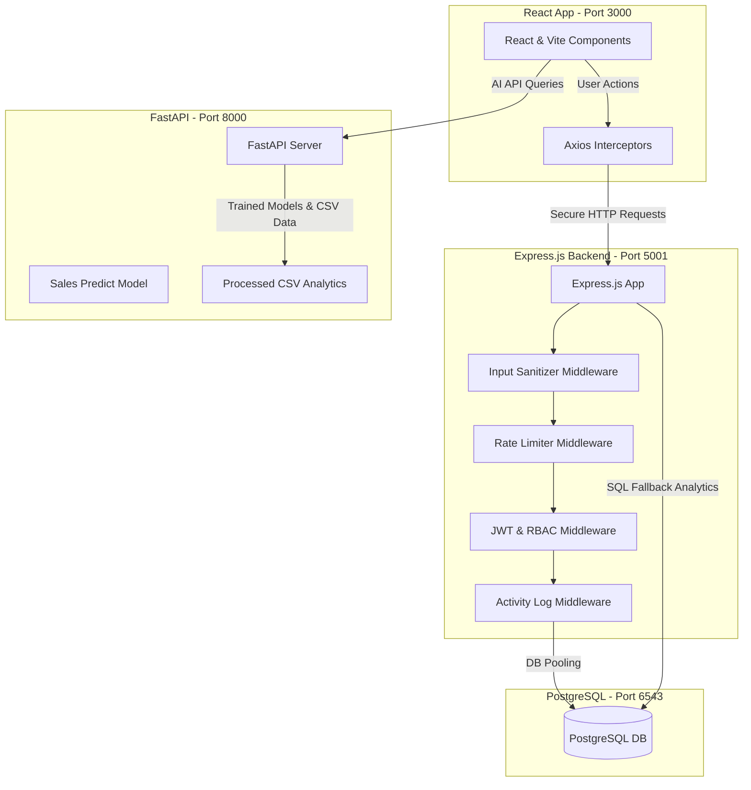
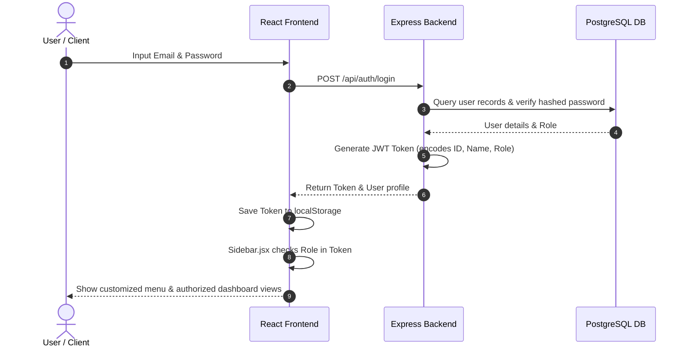
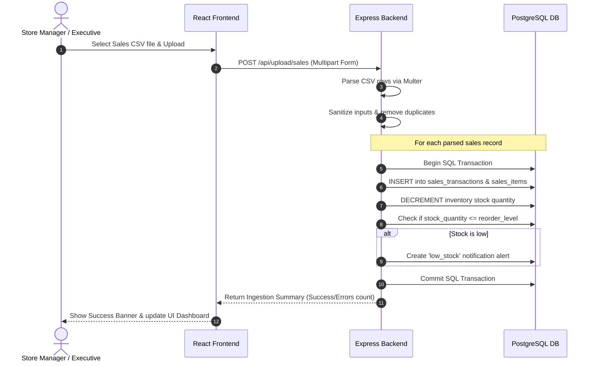
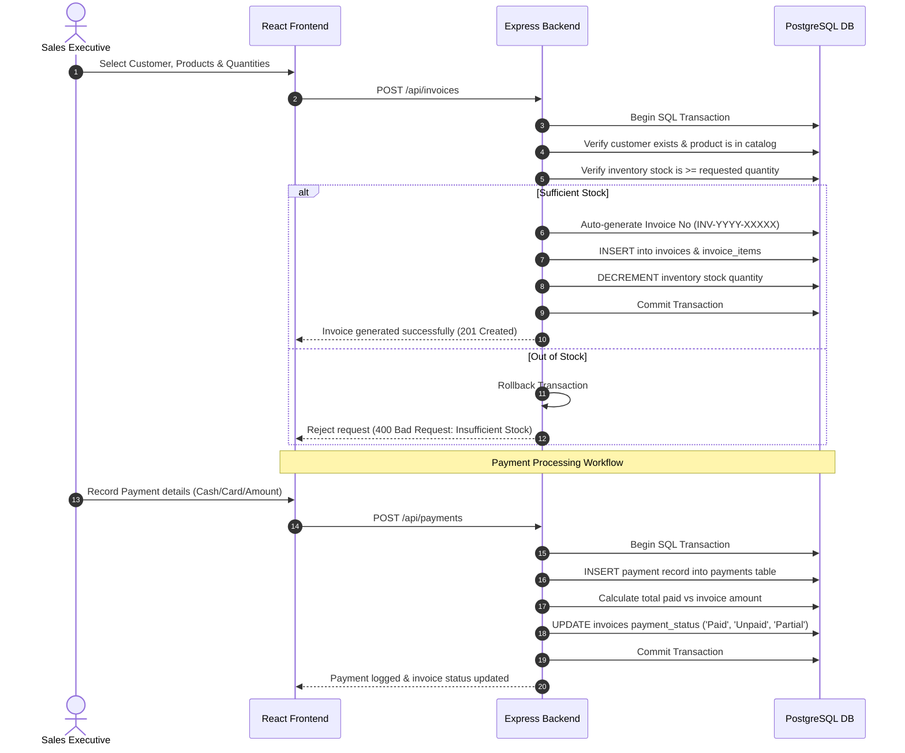
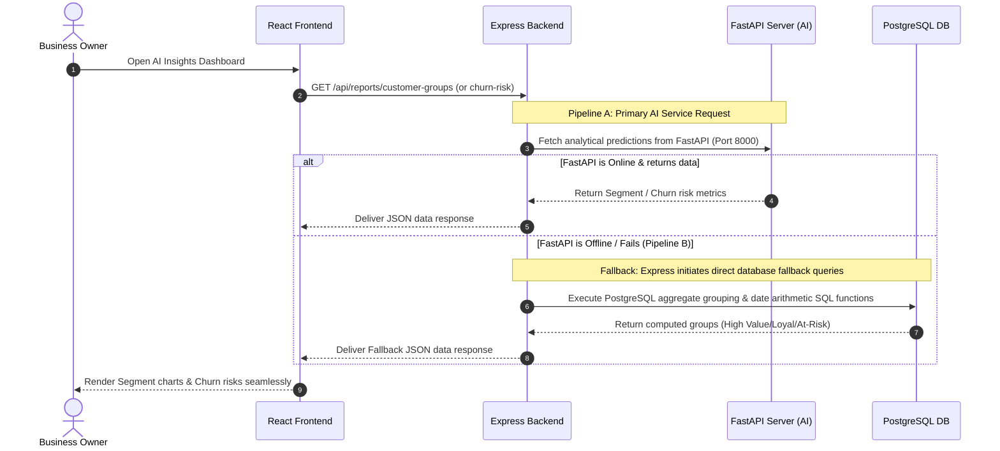

# MarketMind AI Platform – Master Integration & System Specification Document

**Prepared for:** Team 2 Integration Review  
**Subject:** Full System Verification, Database Schema, API Reference, and Working Processes for Interns 1, 2, 3, and 4 (Milestones 1–3)  
**Status:** Integrated & Verified successfully  

---

## 1. Executive Summary

This document serves as the single source of truth detailing the completion, integration, and detailed workflows of the **MarketMind AI Platform**. It captures all components developed by **Intern 1 (Backend & Database)**, **Intern 2 (Security & API Gateway)**, **Intern 3 (Frontend & Dashboard)**, and **Intern 4 (AI/ML)** across **Milestones 1, 2, and 3** (excluding DevOps Intern 5).

The architecture is containerized, secure, and utilizes a dual-pipeline for business intelligence:
1. **Authenticated Access:** Fully secured using JWT-based Role-Based Access Control (RBAC).
2. **Transactional Inventory Safety:** Sales and invoices automatically manage stock levels with low-stock alerts.
3. **Advanced AI & Fallback:** Predictive analytics are powered by a FastAPI Python server, with robust PostgreSQL aggregation queries acting as an automatic fallback if the AI microservice is offline.

---

## 2. System Architecture & Workflows

### 2.1 Core System Architecture

The following block diagram shows how all integrated components communicate across layers:

---

### 2.2 System Workflows (Step-by-Step)

#### Workflow A: User Authentication & Role-Based Navigation
This workflow demonstrates how a user authenticates and the client renders the UI based on their role permissions.

*   **Authorized Sidebar Menus:**
    *   `Sales Executive` sees: Invoice Creation, Client Directory, and Sales uploads.
    *   `Store Manager` sees: Inventory levels, Categories, and general Sales history.
    *   `Business Owner` / `Admin` sees: AI Analytics panels, Audit Logs, and Invoice deletion controls.

---

#### Workflow B: Sales CSV Ingestion & Inventory Processing
This workflow outlines how bulk sales uploads are sanitized, saved, and how stock levels are adjusted automatically.

---

#### Workflow C: Invoice Creation & Payment Processing
This workflow covers step-by-step invoice generation, stock checking, and subsequent payments.

---

#### Workflow D: Dual-Pipeline AI Analytics & Fallback
This workflow illustrates how the application fetches predictive insights, automatically falling back to Database SQL queries if the Python AI service is unreachable.

---

## 3. PostgreSQL Database Schema

The database runs on PostgreSQL. The database tables are defined below:

### 3.1 `roles`
Stores authorization level access privileges.
| Column Name | Data Type | Constraints | Description |
| :--- | :--- | :--- | :--- |
| `role_id` | SERIAL | Primary Key | Auto-incrementing identifier |
| `role_name` | VARCHAR(50) | Unique, Not Null | Name of role (e.g., `System Administrator`) |
| `description`| TEXT | Optional | Description of the user role |

### 3.2 `categories`
Categories of products.
| Column Name | Data Type | Constraints | Description |
| :--- | :--- | :--- | :--- |
| `category_id` | SERIAL | Primary Key | Auto-incrementing identifier |
| `category_name`| VARCHAR(100)| Unique, Not Null | Category label (e.g., `Technology`) |
| `description` | TEXT | Optional | Description of the product category |

### 3.3 `users`
System user logins.
| Column Name | Data Type | Constraints | Description |
| :--- | :--- | :--- | :--- |
| `user_id` | SERIAL | Primary Key | Auto-incrementing identifier |
| `full_name` | VARCHAR(100)| Not Null | User's full name |
| `email` | VARCHAR(100)| Unique, Not Null | Login email address |
| `password` | VARCHAR(255)| Not Null | Bcrypt hashed password |
| `phone` | VARCHAR(15) | Unique, Optional | User contact number |
| `role_id` | INTEGER | Foreign Key -> `roles` | Assigned role permission level |
| `created_at` | TIMESTAMP | DEFAULT NOW() | Record creation date |

### 3.4 `customers`
Purchasing client directory.
| Column Name | Data Type | Constraints | Description |
| :--- | :--- | :--- | :--- |
| `customer_id` | SERIAL | Primary Key | Auto-incrementing identifier |
| `customer_name`| VARCHAR(100)| Not Null | Client company or name |
| `email` | VARCHAR(100)| Unique, Optional | Contact email address |
| `phone` | VARCHAR(15) | Unique, Optional | Contact phone number |
| `address` | TEXT | Optional | Physical address details |

### 3.5 `products`
Product catalog metadata.
| Column Name | Data Type | Constraints | Description |
| :--- | :--- | :--- | :--- |
| `product_id` | SERIAL | Primary Key | Auto-incrementing identifier |
| `product_name` | VARCHAR(150)| Not Null | Name of the catalog item |
| `category_id` | INTEGER | Foreign Key -> `categories`| Link to product category |
| `price` | DECIMAL(10,2)| Not Null, CHECK >= 0 | Sale price per unit |
| `description` | TEXT | Optional | Item description |

### 3.6 `inventory`
Real-time product stock level tracking.
| Column Name | Data Type | Constraints | Description |
| :--- | :--- | :--- | :--- |
| `inventory_id`| SERIAL | Primary Key | Auto-incrementing identifier |
| `product_id` | INTEGER | Unique, Foreign Key -> `products`| Associated catalog product |
| `stock_quantity`| INTEGER | DEFAULT 0, CHECK >= 0 | Number of units in stock |
| `reorder_level`| INTEGER | DEFAULT 10, CHECK >= 0| Alert threshold level |
| `warehouse_location`| VARCHAR(100)| Optional | Storage warehouse location |
| `last_updated` | TIMESTAMP | DEFAULT NOW() | Timestamp of last change |

### 3.7 `sales_transactions`
General transaction ledger ledger rows uploaded via CSV.
| Column Name | Data Type | Constraints | Description |
| :--- | :--- | :--- | :--- |
| `sale_id` | SERIAL | Primary Key | Auto-incrementing identifier |
| `invoice_no` | VARCHAR(50) | Unique, Not Null | Unique transactional identifier |
| `customer_id` | INTEGER | Foreign Key -> `customers`| Customer who purchased items |
| `user_id` | INTEGER | Foreign Key -> `users` | User registering the transaction |
| `total_amount` | DECIMAL(10,2)| CHECK >= 0 | Final transaction total cost |
| `payment_method`| VARCHAR(30) | Not Null | Method used (e.g., `Cash`, `Card`) |
| `payment_status`| VARCHAR(20) | DEFAULT 'Pending' | Transaction status |
| `sale_date` | TIMESTAMP | DEFAULT NOW() | Ingestion timestamp |

### 3.8 `sales_items`
Individual line items related to a sales transaction ledger.
| Column Name | Data Type | Constraints | Description |
| :--- | :--- | :--- | :--- |
| `sales_item_id`| SERIAL | Primary Key | Auto-incrementing identifier |
| `sale_id` | INTEGER | Foreign Key -> `sales_transactions` ON DELETE CASCADE| Parent sales transaction |
| `product_id` | INTEGER | Foreign Key -> `products`| Purchased product item |
| `quantity` | INTEGER | CHECK > 0 | Units sold |
| `unit_price` | DECIMAL(10,2)| CHECK >= 0 | Price per unit at purchase |
| `subtotal` | DECIMAL(10,2)| CHECK >= 0 | Calculated cost (Price * Quantity)|

### 3.9 `invoices`
Formal invoices created interactively.
| Column Name | Data Type | Constraints | Description |
| :--- | :--- | :--- | :--- |
| `invoice_id` | SERIAL | Primary Key | Auto-incrementing identifier |
| `invoice_no` | VARCHAR(50) | Unique, Not Null | Format: `INV-YYYY-XXXXX` |
| `customer_id` | INTEGER | Foreign Key -> `customers`| Recipient customer |
| `user_id` | INTEGER | Foreign Key -> `users` | Salesperson creating the invoice |
| `invoice_date` | TIMESTAMP | DEFAULT NOW() | Creation date |
| `due_date` | DATE | Not Null | Date invoice must be paid |
| `subtotal` | NUMERIC(10,2)| Not Null, CHECK >= 0 | Net cost before taxes/discounts |
| `tax` | NUMERIC(10,2)| DEFAULT 0, CHECK >= 0 | Applied tax amount |
| `discount` | NUMERIC(10,2)| DEFAULT 0, CHECK >= 0 | Discount amount |
| `total_amount` | NUMERIC(10,2)| Not Null, CHECK >= 0 | Gross final cost |
| `payment_status`| VARCHAR(20) | CHECK (Paid, Unpaid, Partial)| Invoice status classification |

### 3.10 `invoice_items`
Line items associated with a created invoice.
| Column Name | Data Type | Constraints | Description |
| :--- | :--- | :--- | :--- |
| `invoice_item_id`| SERIAL| Primary Key | Auto-incrementing identifier |
| `invoice_id` | INTEGER | Foreign Key -> `invoices` ON DELETE CASCADE| Parent invoice reference |
| `product_id` | INTEGER | Foreign Key -> `products` | Linked catalog item |
| `quantity` | INTEGER | CHECK > 0 | Quantity ordered |
| `unit_price` | NUMERIC(10,2)| CHECK >= 0 | Per-unit price |
| `subtotal` | NUMERIC(10,2)| CHECK >= 0 | Row sum (Quantity * Price) |

### 3.11 `payments`
Transactions logging invoice collection.
| Column Name | Data Type | Constraints | Description |
| :--- | :--- | :--- | :--- |
| `payment_id` | SERIAL | Primary Key | Auto-incrementing identifier |
| `invoice_id` | INTEGER | Foreign Key -> `invoices` | Target invoice reference |
| `amount_paid` | NUMERIC(10,2)| CHECK >= 0 | Value received |
| `payment_method`| VARCHAR(50) | Not Null | Method used (e.g., `UPI`, `Cash`) |
| `payment_date` | TIMESTAMP | DEFAULT NOW() | Payment timestamp |
| `payment_status`| VARCHAR(20) | CHECK (Pending, Completed, Failed, Refunded)| State of payment transaction |

### 3.12 `activity_logs`
Security and endpoint usage audit database logging.
| Column Name | Data Type | Constraints | Description |
| :--- | :--- | :--- | :--- |
| `log_id` | SERIAL | Primary Key | Auto-incrementing identifier |
| `user_id` | INTEGER | Foreign Key -> `users` | User who made request |
| `endpoint` | VARCHAR(255)| Not Null | Request URL path |
| `http_method` | VARCHAR(10) | Not Null | HTTP method used |
| `response_status`| INTEGER | Not Null | HTTP status returned (e.g., 200) |
| `execution_time_ms`| NUMERIC(10,2)| DEFAULT 0 | Server execution duration |
| `client_ip` | VARCHAR(50) | Optional | Remote user IP address |
| `event_type` | VARCHAR(50) | DEFAULT 'API_REQUEST' | Action type (e.g., `API_REQUEST`)|

---

## 4. API Specification Dictionary

All requests except Public authentication endpoints require the header `Authorization: Bearer <token>`.

### 4.1 Authentication Module

| HTTP Method | Endpoint | Auth Level / Roles | Description | Request Body / Schema |
| :--- | :--- | :--- | :--- | :--- |
| `POST` | `/api/auth/register` | Public | Register a new user profile | `{ full_name, email, password, phone, role_id }` |
| `POST` | `/api/auth/login` | Public | Validate credentials & get JWT token | `{ email, password }` |
| `GET` | `/api/auth/profile` | Authenticated (Any Role) | Fetch profile of logged-in user | *None* |

### 4.2 Invoices & Payments Module

| HTTP Method | Endpoint | Auth Level / Roles | Description | Request Body / Query Params / Schema |
| :--- | :--- | :--- | :--- | :--- |
| `POST` | `/api/invoices` | Admin, Owner, Sales Executive | Create new invoice & adjust stock | `{ customer_id, user_id, due_date, tax, discount, notes, items: [{ product_id, quantity }] }` |
| `GET` | `/api/invoices` | Admin, Owner, Manager, Sales | Query invoice list (paginated) | *Query:* `search`, `payment_status`, `customer_id`, `page`, `limit` |
| `GET` | `/api/invoices/:id`| Admin, Owner, Manager, Sales | Fetch invoice profile and lines | *None* |
| `PUT` | `/api/invoices/:id`| Admin, Owner | Update invoice metadata details | `{ due_date, tax, discount, notes }` |
| `DELETE` | `/api/invoices/:id`| Admin Only | Delete invoice from record | *None* |
| `PATCH` | `/api/invoices/bulk`| Admin, Owner | Bulk update invoice statuses | `{ ids: [id1, id2], payment_status }` |
| `GET` | `/api/invoices/revenue-summary`| Admin, Owner, Sales Executive | Total revenue and outstanding metrics | *None* |
| `POST` | `/api/payments` | Admin, Owner, Sales Executive | Submit payment against invoice | `{ invoice_id, amount_paid, payment_method, payment_status, transaction_reference, remarks }` |
| `GET` | `/api/payments` | Admin, Owner, Sales Executive | List logged payments | *None* |

### 4.3 Catalog & Inventory Module

| HTTP Method | Endpoint | Auth Level / Roles | Description | Request Body / Query Params / Schema |
| :--- | :--- | :--- | :--- | :--- |
| `GET` | `/api/inventory` | Admin, Owner, Manager | Get inventory catalog levels | *Query:* `search`, `category_id`, `stock_status` (low/normal), `page`, `limit` |
| `PATCH` | `/api/inventory/bulk`| Admin, Owner, Manager | Bulk update stock quantity levels | `{ updates: [{ product_id, stock_quantity, reorder_level }] }` |
| `POST` | `/api/products` | Admin, Owner, Manager | Create product catalog item | `{ product_name, category_id, price, description }` |
| `PUT` | `/api/products/:id`| Admin, Owner, Manager | Edit product metadata | `{ product_name, price, description }` |

### 4.4 Systems Alerts & Reports Module

| HTTP Method | Endpoint | Auth Level / Roles | Description | Request Body / Query Params / Schema |
| :--- | :--- | :--- | :--- | :--- |
| `GET` | `/api/notifications`| Admin, Owner, Manager, Sales | Fetch low-stock and overdue flags | *Query:* `type` (`low_stock` or `overdue_invoice`) |
| `GET` | `/api/reports/sales` | Admin, Owner, Manager | Sales summary report analytics | *Query:* `start_date`, `end_date`, `payment_status` |
| `GET` | `/api/reports/revenue`| Admin, Owner, Manager | Financial revenue collections | *Query:* `start_date`, `end_date` |
| `GET` | `/api/reports/audit-summary`| Admin, Owner | System endpoints activity summary | *None* |
| `GET` | `/api/reports/customer-groups`| Admin, Owner, Manager | Customer clusters (AI fallback) | *None* |
| `GET` | `/api/reports/churn-risk`| Admin, Owner | Customer churn levels (AI fallback) | *None* |
| `GET` | `/api/reports/recommendations`| Admin, Owner, Manager, Sales | Frequently co-bought products (AI fallback) | *None* |
| `GET` | `/api/reports/anomaly-alerts`| Admin, Owner, Manager | Financial anomalies logs (AI fallback) | *None* |

### 4.5 Data Ingestion Module

| HTTP Method | Endpoint | Auth Level / Roles | Description | Request Body / Format |
| :--- | :--- | :--- | :--- | :--- |
| `POST` | `/api/upload/products`| Admin, Owner, Manager | Ingest products list via CSV file | `multipart/form-data` (File field: `file`) |
| `POST` | `/api/upload/sales` | Admin, Owner, Manager, Sales | Ingest sales ledger rows via CSV | `multipart/form-data` (File field: `file`) |

### 4.6 Python FastAPI AI Microservice Module (Port 8000)

These endpoints run on the Python analytical container service.

| HTTP Method | Endpoint | Description | Query Parameters / URL Params | Response Format |
| :--- | :--- | :--- | :--- | :--- |
| `GET` | `/` | Service health status | *None* | `{ "message": "...", "status": "..." }` |
| `GET` | `/predict` | Predict sales for custom features | `quantity` (int), `discount` (float), `year` (int), `month` (int), `day` (int) | `{ "Predicted Sales": 284.89 }` |
| `GET` | `/customer-segment/{customer_id}`| Customer clustering classification | `customer_id` (string) | `[ { "Customer ID": "...", "Segment": "Loyal", ... } ]` |
| `GET` | `/churn-risk/{customer_id}` | Churn likelihood probability | `customer_id` (string) | `[ { "Customer ID": "...", "Churn Risk": "Low", ... } ]` |
| `GET` | `/recommend-product/{product_id}`| Co-purchase recommendations list | `product_id` (string) | `[ { "Product ID": "...", "Product Name": "..." } ]` |
| `GET` | `/anomaly/{order_id}` | Verify transactional anomaly status | `order_id` (string) | `[ { "Order ID": "...", "Anomaly": false } ]` |

---

## 5. Summary of Completed Deliverables

Across Milestones 1, 2, and 3, the following core features are completed and integrated:

### 5.1 Intern 1: Backend & Database Engineer
*   **Database Tables:** Configured PostgreSQL tables with keys and indexing constraints.
*   **Transaction Pipelines:** Created APIs for Invoice Generation (`POST /api/invoices`) and Payment Recording (`POST /api/payments`) wrapping operations in strict transactions to prevent stock imbalances.
*   **System Notifications:** Created notifications triggers checking low stock (`stock <= reorder_level`) and overdue invoice records dynamically.
*   **Hardening:** Applied pagination, query filtering, and search capabilities across all tables, validated by automated TAP unit and integration test runs.

### 5.2 Intern 2: Security & API Gateway Engineer
*   **Middlewares Set:** Added request payload sanitization filters (blocking HTML injection and SQL characters), CORS security whitelisting, and Helmet headers.
*   **RBAC Gates:** Blocked unauthorized roles on secure endpoints (e.g., preventing Sales Executives from accessing audit summaries).
*   **API Rate Limits:** Prevented DoS and Brute Force attacks by applying strict route limits (5 requests per 15 minutes for Auth, 100 requests per 15 minutes for business routes).

### 5.3 Intern 3: Frontend & Dashboard Engineer
*   **UI Views Completed:** Built visual components including user login/register, responsive data dashboards, customer analytics panels, notifications alerts, and invoice billing registers.
*   **Interceptors Configured:** Set up Axios client intercepts attaching the JWT headers to requests.
*   **Interactive Controls:** Added date range filters, category controls, and CSV/PDF exporters.

### 5.4 Intern 4: AI/ML Engineer
*   **AI Microservice:** Deployed FastAPI microservice container serving predictive forecasting, customer clustering, recommendations, and anomaly detection.
*   **Database Fallbacks:** Developed intelligent PostgreSQL query fallbacks to compute groups, recommendations, and anomalies in SQL, ensuring application dashboards stay updated if the Python container is offline.

---

## 6. Verification Status

The system integration is complete, verified, and ready for deployment.
*   **TAP Unit and Integration Tests:** **100% Pass** (5/5 integration, 9/9 unit).
*   **Security Validation Tests:** **100% Pass** (22/22 security test checkpoints).
*   **Docker Container Orchestration:** Verified successful launch of all services via `docker compose up --build`.
