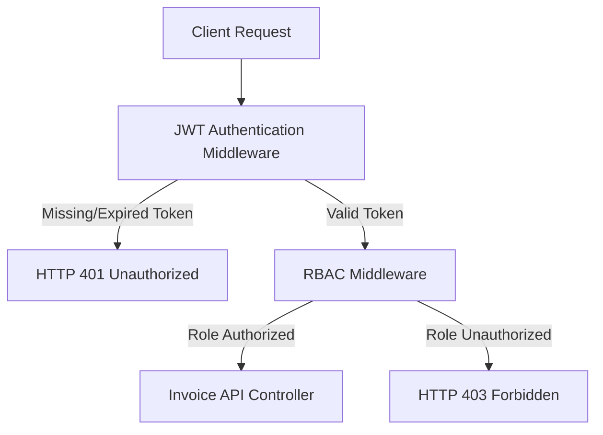

# Role-Based Access Control (RBAC) Guide

This guide details the security configuration, authorization flow, and permissions configuration for the MarketMind AI application, focusing on the **Invoice API** endpoints.

---

## 1. Role Permission Matrix

The application supports four core roles. The table below outlines the access level for each role on the Invoice endpoints:

| Endpoint | Method | Description | Business Owner | Sales Executive | Store Manager | System Administrator |
|---|---|---|---|---|---|---|
| `/api/invoices` | `POST` | Create Invoice | ✅ | ✅ | ❌ | ✅ |
| `/api/invoices` | `GET` | View Invoices (List) | ✅ | ✅ | ✅ | ✅ |
| `/api/invoices/:id` | `GET` | View Invoice Details | ✅ | ✅ | ✅ | ✅ |
| `/api/invoices/:id` | `PUT` | Update Invoice | ✅ | ❌ | ❌ | ✅ |
| `/api/invoices/:id` | `DELETE` | Delete Invoice | ❌ | ❌ | ❌ | ✅ |

---

## 2. Authorization Flow

The security gate executes in a two-step validation pipeline:



1. **JWT Verification (`protect`):** Parses the JWT from the `Authorization` header. Verifies it against the system secret key, decodes user identity and `role_id`, and attaches them to `req.user`.
2. **RBAC Verification (`authorizeRoles`):** Compares the user's role from the JWT against the allowed roles specified for the endpoint. The middleware queries the roles table to resolve the role ID to its actual name/description.
   - If authorized, execution passes to the controller.
   - If unauthorized, a `403 Forbidden` response is returned immediately.

---

## 3. Example Request Headers

All protected endpoints require the client to supply the JSON Web Token in the authorization header:

```http
Authorization: Bearer <JWT_Token_Here>
Content-Type: application/json
```

---

## 4. Error Responses & HTTP Status Codes

### A. Missing Token
* **Scenario:** The `Authorization` header is omitted or not formatted correctly.
* **HTTP Status Code:** `401 Unauthorized`
* **Response Body:**
  ```json
  {
    "success": false,
    "message": "Access denied. No token provided."
  }
  ```

### B. Expired or Invalid Token
* **Scenario:** The token has signature validation failure or is expired.
* **HTTP Status Code:** `401 Unauthorized`
* **Response Body:**
  ```json
  {
    "success": false,
    "message": "Invalid or expired token."
  }
  ```

### C. Unauthorized Role Access
* **Scenario:** A authenticated user tries to access an endpoint their role is not authorized for (e.g., Store Manager trying to create an invoice).
* **HTTP Status Code:** `403 Forbidden`
* **Response Body:**
  ```json
  {
    "success": false,
    "message": "Access Denied"
  }
  ```
