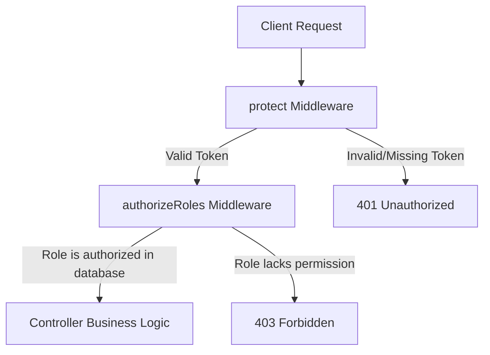

# MarketMind AI - Security & API Gateway Module

## 1. Project Overview
**MarketMind AI** is a comprehensive, state-of-the-art Sales Intelligence Platform engineered specifically for small businesses. It empowers business owners and store managers to make data-driven decisions by providing real-time data insights, automated invoicing, secure payment systems, inventory tracking, and predictive AI reporting.

---

## 2. Security Module Overview
The **Security & API Gateway** module serves as the primary firewall and guardrail for the MarketMind AI backend. It guarantees that:
1. Only authenticated clients can reach internal server endpoints (**Authentication**).
2. Authenticated users can only call endpoints that correspond to their organizational roles (**Authorization / RBAC**).
3. Payload inputs are sanitised and structurally validated *before* reaching the database query layers, preventing database injection, type errors, or arithmetic vulnerabilities (**Joi Request Validation**).

---

## 3. Folder Structure of Security Components

```text
Backend_Dtabase/
├── src/
│   ├── middleware/
│   │   ├── authMiddleware.js        # Parses and validates Bearer JWT tokens
│   │   ├── roleMiddleware.js        # Evaluates RBAC permissions dynamically
│   │   └── validationMiddleware.js  # Joi schemas and validation pipeline
│   ├── routes/
│   │   ├── invoiceRoutes.js         # Protects invoice CRUD, validates inputs
│   │   ├── paymentRoutes.js         # Protects payments records, validates inputs
│   │   └── reportRoutes.js          # Restricts AI report access based on RBAC
│   └── utils/
│       └── generateToken.js         # Generates JWT signature payloads
```

---

## 4. Technologies Used
* **Node.js & Express.js:** Scalable execution environment and web application framework.
* **JSON Web Tokens (JWT):** Lightweight, stateless client credential transmission format.
* **Bcrypt:** Secure cryptographic password hashing technique.
* **Joi (v18.2.3):** Powerful schema description language and validator for JavaScript objects.
* **PostgreSQL:** ACID-compliant relational database management system.

---

## 5. System Flow Architectures

### A. Authentication Flow (JWT)
1. The client logs in by sending an email and password to `/api/auth/login`.
2. The server verifies credentials against PostgreSQL and generates a signed JWT payload containing the user's ID and role ID.
3. The client receives the JWT token and caches it.
4. For all protected requests, the client attaches the header `Authorization: Bearer <JWT_TOKEN>`.
5. The `protect` middleware decodes and verifies the signature, attaching the payload to `req.user`.

### B. Authorization Flow (RBAC)


### C. Request Validation Flow (Joi)
1. The request payload (body or parameter) reaches the route.
2. The `validateBody(schema)` or `validateParams(schema)` middleware intercept it.
3. Joi executes structural validation against the preset schema definitions.
4. If validation fails, Express aborts the process immediately and returns a standardized `400 Bad Request` containing a detailed array of all failed fields.
5. If validation passes, the request proceeds safely to the controller.

---

## 6. Conclusion
By decoupling the security architecture into distinct, reusable middlewares (`protect`, `authorizeRoles`, `validateBody`), MarketMind AI maintains a clean separation of concerns. This ensures developer agility, prevents code repetition, and guarantees enterprise-grade security for small business data.
